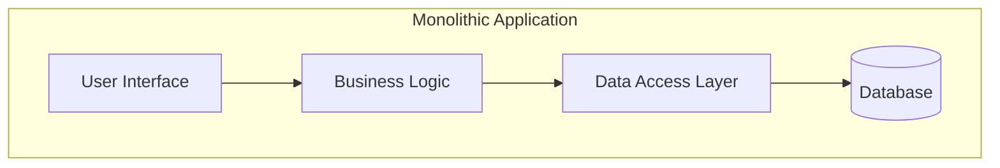
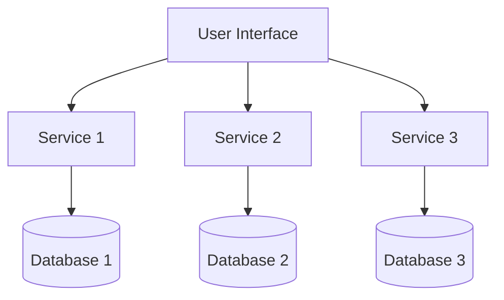

# Introduction to Docker and Microservices

- In a traditional **monolithic architecture**, all components (UI, Business Logic, Data Access Layer) are part of a single, unified application interacting with one central database



- In a **microservices architecture**, the application is broken down into independent services
- Each service handles a specific function, and they communicate with the user interface independently
- Each service may also have its own database (not always)



## B. Install Docker (if not already)
> Docker has a convenient installation script if you're on a *nix-based system. If you're on Windows, [Docker Desktop](https://docs.docker.com/desktop/install/windows-install/) is recommended.

1. In a terminal, download the Docker install script.

```
curl -fsSL https://get.docker.com -o get-docker.sh
```

2. Run the Docker install script.  

```
sh get-docker.sh
```

3. Set permissions so you can run Docker without sudo.

```
sudo groupadd docker
sudo usermod -aG docker $USER
```

4. For the permissions to take effect, logout and back in and/or open a new user shell.

5. Test the Docker installation.

```
docker run hello-world
```

## C. Deploy Sample Microservices App

1. Clone a sample microservices app that deploys a voting app.

```
git clone https://github.com/dockersamples/example-voting-app.git
```

2. Change into the repo's parent directory.

```
cd example-voting-app/
```

3. Bring up the application.

```
docker compose up --detach
```

4. Open the voting page in your browser at [http://localhost:5000](http://localhost:5000) or inspect it in your terminal.

```
curl http://localhost:5000
```

5. Open the results page in your browser at [http://localhost:5001](http://localhost:5001) or inspect it in your terminal.

```
curl http://localhost:5001
```

6. List all the running containers.

```
docker ps -a
```

7. Show the application's container build configuration.

```
cat docker-compose.yml
```

> If the the container that manages the voting page for whatever reason went offline, can people still view the results of the vote? What does this say about the advantages of microservices?

8. Stop the container that manages the voting page.

```
docker stop $(docker ps -q --filter ancestor=example-voting-app-vote)
```

9. Attempt to access the voting page in your browser at [http://localhost:5000](http://localhost:5000) or in your terminal.

```
curl http://localhost:5000
```

10. Attempt to access the results page in your browser at [http://localhost:5001](http://localhost:5001) or in your terminal.

```
curl http://localhost:5001
```

12. Clean up deployment.

```
docker compose down
```
