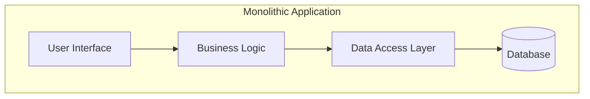
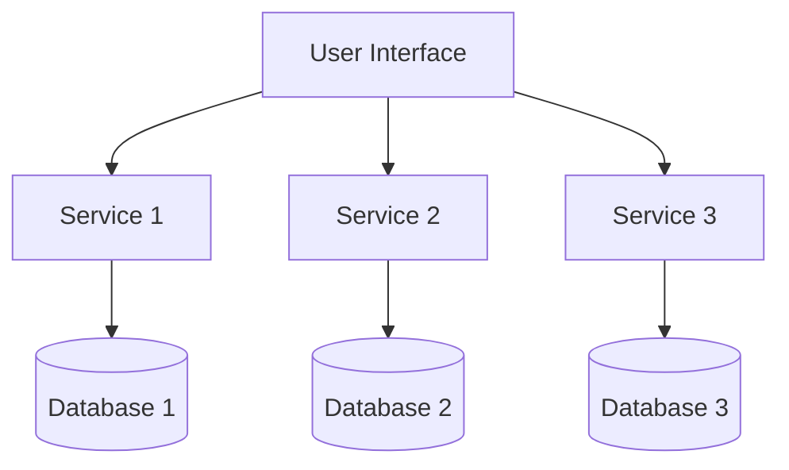
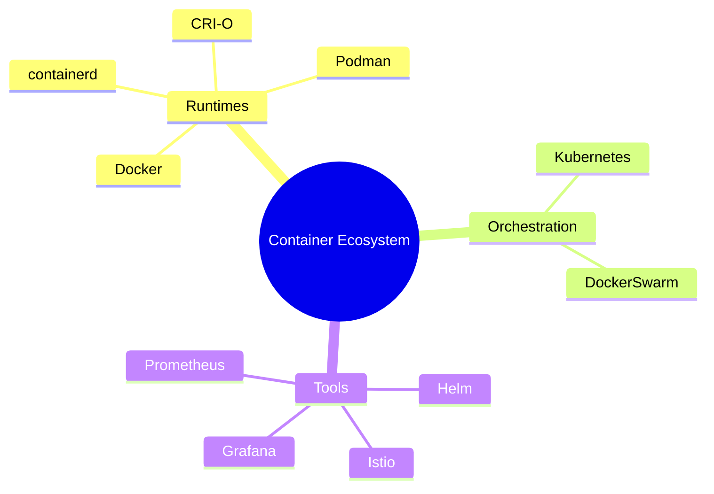

# Introduction to Docker and Microservices

- In a traditional **monolithic architecture**, all components (UI, Business Logic, Data Access Layer) are part of a single, unified application interacting with one central database



- In a **microservices architecture**, the application is broken down into independent services
- Each service handles a specific function, and they communicate with the user interface independently
- Each service may also have its own database (not always)



- Importance of the cloud and **stateless** applications
  - State and logic are decoupled
  - Horizontal scaling, traffic routed to any available instance
  - Elasticity due to swings in demand
  - Multi-region deployments don't have to sync session data

- Core components of being **"cloud-native"**
  - Microservices
  - Containerization
  - Automated orchestration (e.g. Kubernetes)
  - Externalized state
  - API-first communication
 
- **Infrastructure-as-code (IaC)** plays a starring role
 - Reproducable, ideally declarative, text-based configurations of what your deployments and infrastructure look like
 - Used for **provisioning**, i.e. creating the infrastructure needed to host your app
 - Used for **coniguring**, i.e. managing the supporting software and settings inside the infrastructure
 - IaC means can take software development model approach, with code reviews, testing, and PRs

## B. Intro to Docker

### Fundamental differences between containers and virtual machines
| **Aspect**                    | **Container**                                           | **Virtual Machine (VM)**                           |
|-------------------------------|---------------------------------------------------------|----------------------------------------------------|
| **Isolation**                  | Isolated at the process level, sharing the host OS kernel. | Completely isolated with its own OS.               |
| **Operating System**      | Shares the host OS kernel. Each container can run its own app but uses the same OS as the host. | Each VM runs its own OS, independent of the host OS. |
| **Boot Time**                  | Very fast (seconds) since it doesn't need to boot a full OS. | Slower (minutes) because it involves booting the entire OS. |
| **Resource Efficiency**        | Lightweight, requires fewer system resources as they share the OS kernel. | Heavier, as each VM needs resources for its own OS. |
| **Size**                       | Smaller, typically in MBs because containers include only app dependencies. | Larger, often in GBs, as they include the entire OS and apps. |
| **Use Case**                   | Ideal for microservices, rapid deployment, and scaling. | Ideal for running different OS environments or for complete isolation. |
| **Hypervisor**                 | Not needed. Containers run on the host OS using container runtimes (e.g., Docker). | Requires a hypervisor (e.g., VMware, Hyper-V) to manage VMs. |
| **Portability**                | Highly portable across different environments due to consistent runtime. | Less portable, as each VM includes the entire OS and may need compatibility adjustments. |
| **Performance**                | Near-native performance since they avoid the overhead of a full OS. | More overhead since each VM runs its own OS. |
| **Security**                   | Less isolated than VMs since they share the OS kernel, though modern container technologies include strong security mechanisms. | Higher security isolation because each VM is completely separated, including the OS. |

### Current container ecosystem


## C. Install Docker (if not already)
> Docker has a convenient installation script if you're on a *nix-based system. If you're on Windows, [Docker Desktop](https://docs.docker.com/desktop/install/windows-install/) is recommended.

1. In a terminal, download the Docker install script.

```
curl -fsSL https://get.docker.com -o get-docker.sh
```

2. Run the Docker install script.  

```
sh get-docker.sh
```

3. Set permissions so you can run Docker without sudo.

```
sudo groupadd docker
sudo usermod -aG docker $USER
```

4. For the permissions to take effect, logout and back in and/or open a new user shell.

5. Test the Docker installation.

```
docker run hello-world
```

## D. Deploy Sample Microservices App

1. Clone a sample microservices app that deploys a voting app.

```
git clone https://github.com/dockersamples/example-voting-app.git
```

2. Change into the repo's parent directory.

```
cd example-voting-app/
```

3. Bring up the application.

```
docker compose up --detach
```

4. Open the voting page in your browser at [http://localhost:8080](http://localhost:8080) or inspect it in your terminal.

```
curl http://localhost:8080
```

5. Open the results page in your browser at [http://localhost:8081](http://localhost:8081) or inspect it in your terminal.

```
curl http://localhost:8081
```

6. List all the running containers.

```
docker ps -a
```

7. Show the application's container build configuration.

```
cat docker-compose.yml
```

> If the the container that manages the voting page for whatever reason went offline, can people still view the results of the vote? What does this say about the advantages of microservices?

8. Stop the container that manages the voting page.

```
docker stop $(docker ps -q --filter ancestor=example-voting-app-vote)
```

9. Attempt to access the voting page in your browser at [http://localhost:8080](http://localhost:8080) or in your terminal.

```
curl http://localhost:8080
```

10. Attempt to access the results page in your browser at [http://localhost:8081](http://localhost:8081) or in your terminal.

```
curl http://localhost:8081
```

12. Clean up deployment.

```
docker compose down
```
